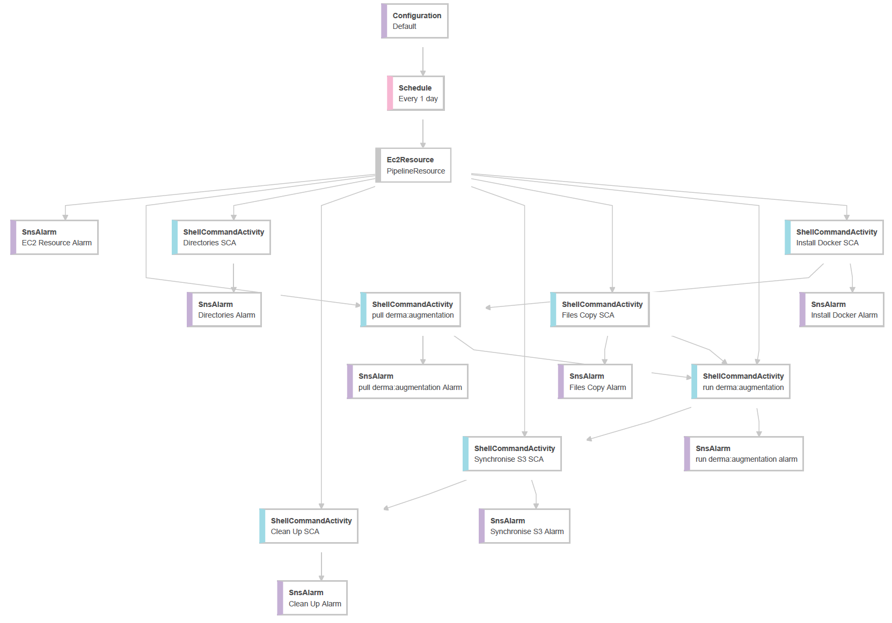

 

<figure>
  
  <figcaption style="font-size:0.65em;padding:35px;text-align:left;margin-left:125px; margin-right:125px"><b>A simple and illustrative Amazon Data Pipeline example.</b>   It runs a containerized software package, i.e., it runs an instance of a container image.  The image is pulled from <a href="https://hub.docker.com/r/greyhypotheses/derma/tags" target="\_blank">Docker Hub</a>. <a href="./cloud/amazon/datapipeline/augmentation.json" target="\_blank">A version of the pipeline's definition code</a> outlines the function of each `ShellCommandActivity` node; each runs one of the <a href="https://github.com/discourses/augmentation/tree/develop/infrastructure/datapipeline/scripts" target="\_blank">augmentation pipeline scripts</a>.</figcaption>
</figure>

 
 
 
 

## Infrastructure

 

**In brief**, the aim of the projects herein is to simplify the repeated use of a variety of (a) frameworks, (b) cloud services, and (c) cloud platforms.  And, the notes & examples are for reference purposes; the notes will be updated continuously.

 

### Cloud Services & Platforms

Focused on templates and small software packages that ease or aid the use of cloud services & platforms

* A program that assigns a specified [VPC Elastic IP Address](https://docs.aws.amazon.com/vpc/latest/userguide/vpc-eips.html) to an EMR Cluster during the cluster's launch; [more](./cloud/amazon/internetprotocol)
* An Amazon Data Pipeline [architecture example](./cloud/amazon/datapipeline); this is an infrastructure-as-code illustration.
* An Amazon EMR (Elastic MapReduce) [cluster launch example](./cloud/amazon/emr).

 

### Frameworks

Quite a variety of frameworks are used for data science, statistics, data engineering, and machine learning engineering, e.g., [Apache Spark](https://spark.apache.org), [Apache Hive](https://hive.apache.org/), etc.  

Each framework project below is akin to a suite of programs that can be used for any *data project* that uses the framework; saving time and reducing/eliminating some repetitive steps.

For example, the [hive](./hive/README.md) project simplifies the process of projecting a structure onto a repository of data files via [Apache Hive](https://hive.apache.org/); it more or less parameterises steps that are repeated per *data project*.

The notes of each project are within each project's section.

* [connecting](./frameworks/connecting/README.md)
* [hive](./frameworks/hive/README.md)
* [scalike](./frameworks/scalike/README.md)
* [spark](./frameworks/spark/README.md)
* [commandline](./frameworks/commandline/README.md)
